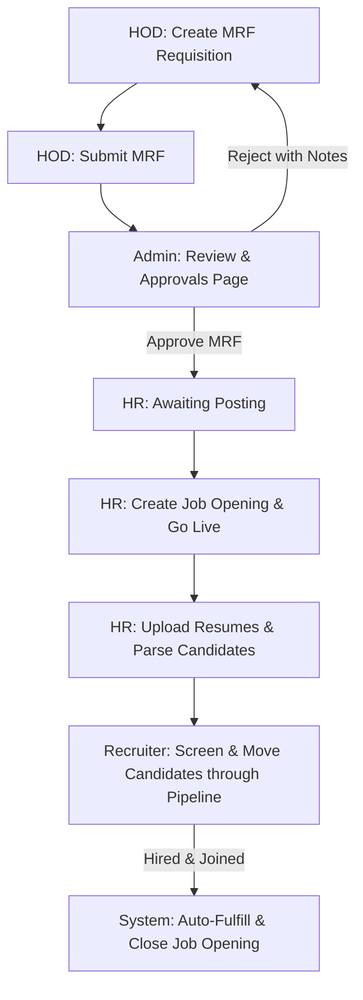

# HR Portal — End-to-End Recruitment & Applicant Tracking System (ATS)

A premium, production-grade Applicant Tracking System (ATS) and Recruitment Portal designed to manage the entire hiring lifecycle. Built with **React + Vite + Tailwind CSS** on the frontend, and connected to a Node.js/Express/MongoDB backend.

---

## 📋 Recruitment Workflow & Process Flow

The system is built around the complete, end-to-end recruitment process:



### 1. Requisition Creation (MRF Submission)
- **HOD Dashboard**: Department Heads (HODs) can draft and submit detailed Manpower Request Forms (MRFs).
- **Physical Form Compliance**: A comprehensive 4-section digital requisition form covering:
  - **Position Details** (Designation, Location, Reports To, Proposed Salary)
  - **Reason for Request** (New Position / Replacement For, Vacancy count)
  - **Job Description** (Purpose of the job, Roles & Responsibilities)
  - **Qualification & Criteria** (Specializations, Qualification level, Preferred industries, IT requirements)

### 2. Requisition Approvals
- **Admin Approvals**: Admins review pending manpower requests through a dedicated list.
- **Digital Paper View**: Admins can open the paper-formatted MRF template, inspect the details, and either **Approve** (which makes the request available to HR for posting) or **Reject** (with comments sent back to the HOD for correction).

### 3. Resume Management & Candidate Ingestion
- **Resumes Upload**: HR can select an approved job requisition and drag-and-drop multiple resume files.
- **Ingestion Details**: Input candidates' basic profiles, experience details, and keep links to uploaded files.

### 4. Recruiter ATS Split-Pane Pipeline
- **Recruitment Dashboard**: Built like a modern ATS with 4 status-based category boards:
  - **Awaiting Posting** (Approved MRFs awaiting HR to launch recruitment)
  - **Active Live Jobs** (Requisitions currently actively receiving candidates)
  - **Closed Jobs** (Manually closed positions or cancelled requisitions)
  - **Filled Positions** (Successfully hired roles)
- **Split-Pane Workspace**: Selecting a job opening loads a side-by-side view showing the jobs list on the left and the interactive candidate pipeline list on the right.
- **Pipeline Stage Management**: Drag or update candidate stages from *New*, *Screening*, *Shortlisted*, *Interview Scheduled*, *Offered*, *Joined*, to *Rejected*.

### 5. Fulfillment & Auto-Closure
- **Hiring Completion**: Moving a candidate's status to **Joined** prompts for their Date of Joining (DOJ) and marks the candidate as successfully placed.
- **Auto-Fulfill**: Once the target vacancy count is reached, the backend automatically sets the Job Opening status to `Fulfilled` (Closed), registers the closure date, and moves it to the **Filled Positions** section.

---

## 📁 Folder Structure

```
hr-portal-client/
├── index.html
├── package.json
├── vite.config.js
├── tailwind.config.js
└── src/
    ├── main.jsx              ← Entry point
    ├── App.jsx               ← Routes & Protected views
    ├── index.css             ← Global styles, custom scrollbars, animations, & themes
    ├── components/
    │   ├── Navbar.jsx        ← Dynamic navigation header (role-based)
    │   ├── MRFForm.jsx       ← 4-section Manpower Request Form
    │   └── ResumeUpload.jsx  ← Candidate ingestion workspace
    ├── context/
    │   └── ThemeContext.jsx  ← Light/Dark mode state management
    ├── pages/
    │   ├── Login.jsx                 ← HR Portal Role-based Login
    │   ├── OverviewDashboard.jsx     ← Analytics dashboard
    │   ├── MyMRFsPage.jsx            ← HOD self-service center (optimistic updates)
    │   ├── AdminMRFApprovalsPage.jsx ← Admin approvals center (interactive tabs)
    │   └── HRPage.jsx                ← Recruiter ATS workspace (split-pane pipeline)
    └── services/
        └── api.js                    ← Axios integration layer with credentials
```

---

## 🛠️ Installation & Running Dev Server

```bash
# 1. Install packages
npm install

# 2. Run local server in dev mode
npm run dev

# 3. Open local portal
# URL: http://localhost:5173
```

### Setup API Endpoint
To point the client to a custom backend API server, update `.env` or use the default local address:
```env
VITE_API_URL=http://localhost:5000/api
```

---

## 🎨 Theme & Accessibility
- **Light & Dark Themes**: Fully supports both light and dark UI preferences with a global state context. Toggle the switch in the navbar to change modes instantly.
- **Scrollbars & Highlights**: Customized custom-scrollbar classes inside split panels for scrolling efficiency, along with glow-border states.
